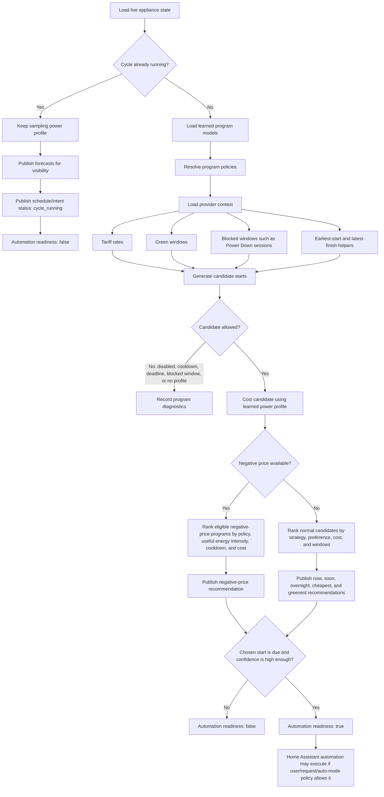

# Architecture

## Overview

Load Optimizer is split into four layers:

1. Core learning and optimisation logic
2. Provider context inputs
3. Device adapters
4. Home Assistant entity, automation, and dashboard surfaces

The core must not depend on Bosch, Home Connect, Octopus Energy,
washing-machine-specific logic, or any other single appliance or supplier.

## Core Responsibilities

- Detect when a cycle starts.
- Sample power during the cycle.
- Detect when a cycle ends.
- Build and maintain learned summaries.
- Estimate cost or score for a future run from normalized provider inputs.
- Select an economical start window.

## Provider Context Responsibilities

Provider context inputs supply external information that helps the core compare
candidate starts. They must be optional, normalized before use, and treated as
data sources rather than product dependencies.

Examples include:

- tariff-rate entities
- greener or lower-carbon calendar windows
- carbon-intensity sensors
- local solar generation forecasts
- battery state, reserve, and charge/discharge limits
- manually configured fixed-rate tariffs

Octopus Energy, BottlecapDave's Octopus Energy integration, Octopus
Intelligence, TripIt, solar inverters, and battery integrations are all examples
of provider layers. None should be hard-coded as a core requirement.

The preferred provider contract is:

- **Price source**: supplies normalized future prices.
- **Green window source**: supplies preferred low-carbon or greener time
  windows.
- **Local energy source**: supplies optional household generation or battery
  context.
- **Deadline source**: supplies optional earliest-start or latest-finish
  constraints.

The core should rank candidates using those normalized concepts rather than
calling provider-specific APIs directly.

## Device Adapter Responsibilities

Each adapter should:

- read device-specific sensors
- normalize program names
- decide when a cycle is active
- map live state into the shared model
- expose only the minimum device-specific concepts needed by the core

## Home Assistant Responsibilities

Home Assistant should be used for:

- source power, energy, program, and state sensors
- tariff entities from any compatible supplier integration or custom source
- optional calendar or sensor entities that describe greener, travel, or local
  energy context
- published `sensor.load_optimizer_*` entities from the App
- dashboards, notifications, and automations built on top of those sensors

## Optional Automation Layer

Status: First dishwasher implementation

Load Optimizer should remain the recommendation engine, not the appliance
launcher. Home Assistant automations should own household-specific execution:
buttons, voice assistants, announcements, Bosch/Home Connect service calls, and
manual cancellation.

The first optional package is
`homeassistant/packages/load_optimizer_dishwasher_automation.yaml`. It is scoped
to Dishwasher 1 and uses the published recommendation sensors for `now`, `soon`,
and `overnight` requests. The package stores the user's chosen intent in Home
Assistant helpers, regularly re-checks the current Load Optimizer recommendation,
and starts the Bosch dishwasher only when the matching recommendation is due.

This package is intentionally separate from:

- the learning engine
- other appliance instances
- negative-price automation, still opt-in per program and household

That separation lets the app keep learning and recommending for many appliance
types while household-specific automations decide if and how an appliance should
be physically started.

## Canonical Entities

The first appliance instance should use the `load_optimizer_1_*` namespace.

Published App sensors include:

- `sensor.load_optimizer_1_status`
- `sensor.load_optimizer_1_power`
- `sensor.load_optimizer_1_energy`
- `sensor.load_optimizer_1_program`
- `sensor.load_optimizer_1_cycle_state`
- `sensor.load_optimizer_1_sample_count`
- `sensor.load_optimizer_1_peak_power`
- `sensor.load_optimizer_1_last_program`
- `sensor.load_optimizer_1_last_runtime`
- `sensor.load_optimizer_1_last_energy`
- `sensor.load_optimizer_1_last_finish`
- `sensor.load_optimizer_1_last_profile`
- `sensor.load_optimizer_1_total_runs`
- `sensor.load_optimizer_1_learned_programs`
- `sensor.load_optimizer_1_program_catalogue`
- `sensor.load_optimizer_1_program_model`
- `sensor.load_optimizer_1_program_policies`
- `sensor.load_optimizer_1_cost_status`
- `sensor.load_optimizer_1_cheapest_start`
- `sensor.load_optimizer_1_cheapest_cost`
- `sensor.load_optimizer_1_cost_if_started_now`
- `sensor.load_optimizer_1_potential_saving`
- `sensor.load_optimizer_1_cost_confidence`
- `sensor.load_optimizer_1_recommended_program`
- `sensor.load_optimizer_1_overnight_readiness`
- `sensor.load_optimizer_1_negative_price_readiness`
- `sensor.load_optimizer_1_remote_activation_check`
- `sensor.load_optimizer_1_automation_package_status`

## Data Flow

1. Adapter reads live device sensors.
2. Core decides whether the instance is idle, active, or finishing.
3. Core stores sampled power into the current profile.
4. Core writes end-of-cycle summary data.
5. Core updates the learned database.
6. App sensors expose learned values, cost estimates, and recommendations.

## Persistence Strategy

The supported runtime stores internal data in the App's private `/data`
directory and publishes Home Assistant sensors for visibility.

That gives:

- a clean public installation path
- app-owned persistence that does not require user-managed helpers
- transparent read-only state for dashboards and automations

## Energy Measurement

Status: Active design principle

Completed-cycle energy should be calculated from captured power samples wherever
possible. Integrating the power profile avoids common problems with daily energy
counters, including:

- multiple cycles on the same day
- cycles that span midnight
- source sensors that reset, round, or lag unexpectedly

Energy sensors can still be exposed and retained as diagnostic metadata, but the
learned model should prefer profile-integrated energy so the same approach works
across dishwashers, washing machines, EVs, and other future load types.

## Scheduling Model

Status: Active design principle

Scheduling should be split into two separate concepts:

- **Constraints** define which candidate starts are allowed.
- **Strategies** decide which allowed candidate is preferred.

This distinction keeps the app device-agnostic and avoids mixing user intent
with safety rules.

Examples of constraints:

- earliest allowed start
- latest allowed finish
- must finish before a deadline
- avoid a calendar window
- only start during an overnight or daytime window
- only allow selected programs
- optionally prefer or avoid windows based on local solar generation or battery
  availability once those sources are supported

Examples of strategies:

- `cheapest_earliest_finish`: choose the cheapest acceptable slot, but prefer the
  earliest finish among near-equivalent candidates
- `cheapest_latest_finish`: choose the cheapest acceptable slot, but prefer the
  latest finish among near-equivalent candidates
- `cheapest_absolute`: choose the mathematically cheapest candidate even if it
  delays the run for a very small saving

A deadline is therefore not the same as a strategy. A deadline narrows the valid
window; a strategy ranks the remaining valid options. For a dishwasher before
travel, the likely model is a deadline constraint plus `cheapest_earliest_finish`. For a
future EV or battery use case, the likely model is a departure deadline plus
`cheapest_latest_finish`.

The App runtime exposes advisory scheduling entities. The optional Home Assistant
automation package may start a configured appliance only after constraints,
confidence thresholds, remote-control prerequisites, and user permissions have
been proven immediately before execution.

## Decision Flow

Status: Active implementation contract

The optimiser separates recommendation maths from automation permission. A cost
forecast can remain valid while an appliance is already running, but
automation-facing entities must not advertise `ready_to_start` or
`good_to_start` during an active capture.

Automatic mode must sit after this flow, not beside it. That means an unattended
automation should only act when the chosen intent sensor says it is ready, the
instance is idle, the recommendation is still current, and any household safety
checks pass immediately before execution.

The first automatic-mode implementation follows the same helper contract as
manual dashboard or voice requests. For Dishwasher 1, the optional
`input_boolean.load_optimizer_1_auto_negative_price_enabled` helper can allow a
ready negative-price recommendation to populate the requested mode, program, and
start helpers. The existing execution automation then performs the Bosch checks,
attempts the start, records the result, announces failures, and clears the
request. This keeps unattended operation opt-in and avoids a separate privileged
start path.

## Execution Audit Contract

Status: Active implementation contract

Each dishwasher request records three persistent Logbook stages:

1. `request_received`, with the queued start and the latest recommendation
   snapshot.
2. `command_sequence_started`, only after every pre-command gate passes.
3. A terminal outcome: `confirmed`, `cancelled`, `blocked`, `expired`, or
   `failed`, with a stable reason code and readable detail.

The package keeps the machine-readable reason in
`input_text.load_optimizer_1_last_start_reason_code`, the explanation in
`input_text.load_optimizer_1_last_start_reason_detail`, and the values used by
the decision in `input_text.load_optimizer_1_last_start_decision_snapshot`.
These fields are set before the terminal result changes so downstream
automations and Logbook entries observe one consistent outcome.

Queued-plan revalidation uses the following precedence:

| Condition | Result | Reason code |
|---|---|---|
| Latest recommendation is not ready | Cancelled | `recommendation_not_ready` |
| Queued program is absent from the latest eligible options | Cancelled | `queued_program_missing_from_latest_recommendation` |
| Latest confidence is below the configured threshold | Cancelled | `confidence_below_threshold` |
| Latest start moved by more than 15 minutes | Cancelled | `recommended_start_changed` |
| Request is more than 30 minutes late | Expired | `stale_request` |
| Appliance prerequisites fail | Blocked | Specific connection, door, or remote-control code |
| No running state is observed after all command paths | Failed | `not_running_after_start` |

A due automatic request bypasses recommendation-drift cancellation and proceeds
to the stale-request and appliance-safety gates. This prevents a recommendation
refresh at the due minute from cancelling an otherwise valid scheduled run.

When a confirmed cycle changes from `running` to `idle`, the package records a
separate `cycle_end` Logbook event. The observed Bosch operation state classifies
it as completed, failed, aborted, or `ended_unconfirmed`; it does not silently
label every idle transition as a successful completion.

## Local Energy Context

Status: Future design principle

The tariff price is only one part of the real household cost when a home has
solar generation or battery storage. Future cost estimation should be able to
combine the learned load profile with optional local-energy sensors, including:

- current and forecast solar generation
- battery state of charge
- battery charge and discharge power limits
- battery round-trip efficiency
- export tariff or deemed export value
- user preference to reserve battery capacity for household resilience or other
  loads

This should remain optional and supplier-agnostic. Users without solar or
batteries should not need to configure these fields, and users with local energy
systems should be able to decide whether the optimiser values self-consumption,
export revenue, battery preservation, or pure grid-import cost.

## Greener Window Context

Status: Future design principle

Some users may prefer a slightly more expensive run if it lands in a greener or
lower-carbon window. This should be modelled as an optional provider input, not
as an Octopus-only feature.

The first version should accept a generic Home Assistant calendar or sensor that
marks preferred green windows. Provider-specific sources can be retired or
renamed, so the core should only care that a candidate start overlaps a green
window. BottlecapDave's Octopus Energy integration removed Greener Nights in
v19.0.0 after the upstream service was discontinued.

Future scheduling strategies may include:

- `cheapest`: choose the lowest total cost.
- `greenest`: choose the best available green-window candidate.
- `balanced`: prefer green candidates when the extra cost is within a configured
  tolerance.
- `greenest_if_within_budget`: choose green only when the difference from the
  cheapest candidate is acceptable.

The app should expose both values when possible:

- cheapest possible cost and start
- greenest acceptable cost and start
- extra cost of choosing the greener option

This keeps environmental preference visible without hiding the financial
tradeoff from the household.

## Calendar And Deadline Context

Status: Recommended full-automation direction

Calendar integration is not required for core learning, cost estimation, or
basic cheapest-start recommendations. It is recommended for the full scheduling
experience because real households have deadlines and availability windows that
cannot be inferred from tariff data alone.

Calendar or helper-driven deadlines should allow the app to answer questions
such as:

- must the cycle finish before travel?
- is there a household deadline tomorrow morning?
- should an appliance avoid running while the user is away?
- is a cheap slot still useful if it finishes after the user needs the appliance?

TripIt is a recommended travel-calendar source because it can automatically
convert flights, rail, hotels, and itinerary emails into calendar events exposed
to Home Assistant. Other Home Assistant calendar entities should also be
supported where they provide reliable upcoming events.

The preferred implementation path is:

1. Add Home Assistant helper-based deadline inputs as the stable app contract.
2. Let user automations, including TripIt automations, populate those helpers.
3. Later add direct calendar polling as a convenience layer.

This keeps the app useful for people who do not use TripIt while still providing
a clear recommended setup for travel-aware scheduling.

## Roadmap Boundaries

Planned work, backlog items, and future feature ideas live in
`docs/roadmap.md`. This keeps the architecture document focused on the current
shape and design principles of the system.

## Retired Local Infrastructure

The earlier local appliance packages, templates, helper definitions, dashboards,
and Pyscript files are no longer part of the repository. Future contributions
should target the supported App runtime and avoid reintroducing app-managed
`dishwasher_*` or `washing_machine_*` helper namespaces.
